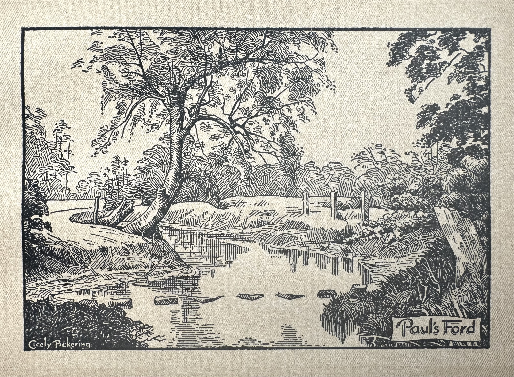

<h2 id="5">To Paul's Ford and Burton Hastings (June)</h1>

<figure>
    
    <figcaption>Paul's Ford (Across the River Anker)</figcaption>
</figure>

Those who sought the fields and country lanes this week-end in the first days of June, will have been charmed with the billowy clouds of "May Blossom" lining the hedgerows and dotting the park lands where patches of ancient hawthorn have been allowed to grow free. The "May Blossom" is late. Joseph Dare, our unhonoured Hinckley poet, wrote:

> When clustered primroses look gay, 
> And twinkling wind-flowers star the woods— 
> Oh! then _begins_ the gentle May. 
>  
> When far o'er hill and sunny sea, 
> The swallow on swift wing comes back, 
> And from the green wood suddenly 
> The cuckoo shouts upon your track, 
> Oh! then it _is_ the merry May. 
>  
> When wood and field and everywhere, 
> Grows sweet to sense and fair to sight, 
> When hawthorn buds are silvering through 
> Bending with starry bloom each spray 
> And speedwell opes its eyes of blue— 
> Oh! then it is the _full blown_ May.

On a fine sunny day the country around Paul's Ford, where the Sketchley brook joins the River Anker, will be found a pleasant spot at any time of the year. I wonder how many Hinckley people other than our "friends with the dog," have heard of it?

To the Ford and by Attleborough Gorse to Burton Hastings, returning by Sketchley Lane, is little more than six miles. It is good going and the path can be easily traced. Take the Red 'Bus to the Wharf Inn, follow Dr. Nutt's Lane to the Watling Street and immediately opposite will be seen a stile where our walk commences. After crossing one field by a hedgeside path we come to Hydes Lane. We then turn right and follow the lane (passing a farm house on the right) until we come to a gate and a bridle road. This bridle road passes over Paul's Ford and comes out by the golf course on the Attleborough Road near the White Stone.

Part of Hinckley parish known as The Hyde is in Warwickshire. Hydes Lane forms the parish boundary until we come to the second field of the bridle road. It then picks up the Sketchley brook one field away and returns across the Watling Street along the winding course of the Harrow brook. Like Wykin, the Hydes once had its little church or chapel served by the Monks of Hinckley.

We follow the bridle road until Nuneaton comes into view on our right. The footpath and road then divide for a time, but either route can be taken. Towards the river valley where the fields dip steeply, the scene becomes a very picturesque one. Some tall elm trees and in the mid distance a fine witch-elm, rise above a smaller coppice of birch and hazel. Some ancient hawthorns mark the direction of the disused horse-road and a number of hoary-looking crab trees probably gave name to the small farm buildings, known as Crab House, on our left. On our right is a large semi-circular excavation resembling an amphitheatre.

At the bottom of the slope we come to Paul's Ford where the bridle road crosses the little River Anker. One can profitably spend an hour or two in this pretty spot and enjoy a rest by the river side. If we have brought a few sandwiches and a flask, so much the better. There is nothing like a walk for inducing good digestion to wait on appetite.

If we follow the stream down course for a few yards we come to a miniature water's meet where the Anker is joined by the Sketchley Brook. In the other direction is an interesting bit of bog land. Growing between the tussocks of rush are a host of wildflowers, and along the water-courses the pretty marsh valerian is now in full bloom. The little sketch that accompanies this article was taken from the footbridge close by the Ford.

We chose to cross by the stepping stones and followed the bridle path to the middle of the next field where it is crossed by a footpath emerging from a gate on our right. At this point no less than six pathways meet.

To keep straight on would bring us out at Attleborough, so we turn sharp left for Burton Hastings, and make for the Hill Farm immediately in front of us. After passing through the farm yard and one field beyond we come to a wide woody lane, fringed with slow bush, briar and bramble. Leaving the lane we cross the middle of the next field, keeping a small pond on our left and reach the corner of Attleborough Gorse by a stile.

Attleborough Gorse is well known as a fox covert with the Atherstone Hunt, otherwise few people would have heard of it. Its name is misleading. There are a few gorse bushes there truly, but it is really a partly cleared wood with velvety turf and clumps of undergrowth, brakes of fern and foxgloves, and at one end a small plantation of silver birch. From the chorus of song, it might be a bird sanctuary.

A lane runs along the north side of Attleborough Gorse, and we return to this to follow our trail. As we leave the lane we cross a brick arch spanning one branch of the River Anker, and turn sharp right through a field to reach Burton village by the old mill. This is one of the few remaining flour mills in the district worked by water wheel. Although the present buildings are much later, it is more than likely that this has been a flour mill from before the Norman Conquest. Amateur photographers might obtain permission to take a view of the mill from across the mill dam. It is a very picturesque spot reminiscent of the Constable country. After passing over the canal bridge we reach the village of Burton Hastings by a winding lane near the Glebe Farm.

Dugdale suggests that Burton derives its name "from the old English word burh or burgh, signifying with the Saxons not only a place fortified with some warlike rampier or wall, but that which had a kind of fence or closure about it."

On the north side of the church is a field surrounded by a mound and vallum. This trench or moat very probably encircled the church and churchyard, and has every appearance of an enclosure suggested by Dugdale. The church being dedicated to St. Botolph one would surmise there was a church here in Saxon times.

Its name also indicates that the demesne was once in the hands of the powerful family of Hastings, whose many possessions included the castles of Ashby-de-la-Zouch, Fillongley and Kirby Muxloe. They bore for arms a peculiar device in the shape of a long sleeve called a manchlet, still to be seen in the windows of many village churches in the neighbourhood, including Barwell. The device is engraved in stone on the south wall of Smisby Church.

Half of the "town" of Burton at one time belonged to the Abbess of Nuneaton Priory. This doubtless included the Grange Farm. Sir Ralph Hastings owned the other portion. Sir Ralph was a very turbulent knight and was attainted for treason in the reign of Henry IV. for conspiring with Scroop, Archbishop of York, and others, against the king. This unfortunate intrigue with his Grace cost him his head, to say nothing of his estate in Burton. The connection of the family with this village, however, ends up more happily, for we are told that Richard, Ralph's surviving younger brother, owing to his better affections to the Crown, had restitution of his lands, and was made Sheriff of the counties of Leicestershire and Warwickshire.

He was retained by indenture to serve King Hal and his wars overseas with ten men at arms and 30 archers. His wages were fixed at 2s. per day. His men at arms 1s. per day and 6d. for every archer. Considering that the currency in those days had many times its present value, this was a very substantial army pay.

We must pay a visit to the church before continuing our journey. It was restored a few years ago when the old box pews were taken down and used very judiciously for wainscot in the chancel. So much old oak has been taken out of churches during the past fifty years and destroyed or sold to "old-furniture" makers. A priest's doorway to rood loft, a fourteenth century font, and two oaken parish chests in the tower are objects of interest. A low window in the south wall of the chancel used to be thought a leper's window. On the assumption that lepers who were forbidden the church would thus be enabled to witness the celebration of Mass at the High Altar.

There is one remarkable thing about Burton-Hastings that not every visitor will discover. There is no public house there, nor one within two miles. One instinctively looks for it near the church, for did not Defoe write in _"The Trueborn Englishman"_:

> "Wherever God erects a house of prayer, 
> The devil always builds his chapel there; 
> And 'twill be found upon examination 
> The latter always has the largest congregation." 

Some might think the disappearance of the devil's chapel to be a good sign of the times, but the prosperity of "Little Burton" has gone with it. In spite of the temporary depression that permeates all agricultural communities, to me a village inn under a good host is still a cheery, homely place.

Not many years ago the village was associated with the name of a rather eccentric vicar. The Rev. Digby Turpin died at the age of 75 and lies buried in the churchyard. For many years he lodged in Hinckley and walked many miles weekly to and from his parish on Sundays. The old sexton used to start ringing the bell as soon as he saw his reverence coming along the canal side. But in his declining years there were many occasions when not a single soul responded, and the parson and sexton went through the service alone. When the Rev. Turpin eventually built a vicarage, he placed it as far from the church as possible, on the farthermost boundary of his parish. He lived a bachelor, but shortly before his death married his housekeeper.

The lonely little hamlet of Shelford is in the ecclesiastical parish of Burton Hastings. It was from Shelford Hall that Lady Smythe was taken to Wolvey Heath to be burned at the stake for the murder of her husband. It is recorded that a reprieve was granted, but the messenger who rode in hot haste from London foundered in a bog at Cloudesley bush, two miles only from his goal.

To return to Hinckley we take to the fields by a gate opposite the old Manor Farm, the last house in the village on the Hinckley road. This is a real short cut and must have been a boon to the farmers’ wives who may have missed the carrier’s cart, when bringing their produce weekly to Hinckley butter markets. It is 1½ miles farther round by the main road.

The path is well defined. It crosses the canal bridge at the bottom of the first long field and again by another bridge near Poplar Lodge. It then crosses five fields in the middle of the ancient ecclesiastical parish of Stretton Baskerville. We pass the site of the long lost church with its dried-up fish ponds and grass-grown mounds covering the foundations of a vanished village, a field away on the right.

At the Watling Street the path is picked up by a stile immediately opposite. This crosses one field to the Sketchley Lane. We can then return home either by a footpath directly in front of us or by Sketchley Hall and the railway station. If we choose the latter we shall pass by the famous well, now marked by a prosaic pump, near the Hall where

> “The dolt when drinking finds his wits grow clearer, 
> And genius gains its inspiration there.”

The walk can be shortened by going on to Nuneaton from Paul’s Ford and returning by ’bus or by a footpath near the Hydes Lane through Beasley’s Farm and Stretton Fields.
